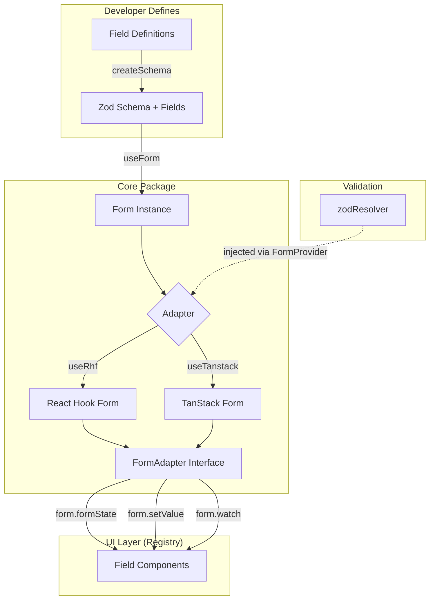

# @buildnbuzz/buzzform (Core)

The headless core logic for BuzzForm. This package handles schema generation, validation adapters, and state management normalization. It is UI-agnostic.

## Architecture

BuzzForm separates logic into three distinct layers:

1.  **Schema Layer**: Converts JSON field definitions into Zod schemas.
2.  **Adapter Layer**: Normalizes different form libraries (RHF, TanStack) into a common `FormAdapter` interface.
3.  **UI Layer**: (External) Renders the actual components based on the state provided by the core.

### Data Flow



## Contributing

### 1. Adding a New Field Type

To add a new field type (e.g., `ColorPicker`):

1.  **Define Interface**: Add the field interface to `src/types/field.ts`.
    ```typescript
    export interface ColorField extends BaseField<string> {
      type: "color";
      format?: "hex" | "rgb";
    }
    ```
2.  **Update Union**: Add `ColorField` to the `Field` union type in `src/types/field.ts`.
3.  **Create Builder**: Create a schema builder in `src/schema/builders/color.ts`.
    ```typescript
    export function createColorFieldSchema(field: ColorField) {
      return z.string().regex(/^#/, "Must be a hex color");
    }
    ```
4.  **Register Builder**: Add it to the switch case in `src/schema/fields-to-schema.ts`.
5.  **Export**: Add the type export in `src/index.ts`.

### 2. Implementing a New Adapter

Adapters allow BuzzForm to run on different underlying form engines. To add one (e.g., for Formik):

1.  Create `src/adapters/formik.ts`.
2.  Implement the `FormAdapter<TData>` interface:
    ```typescript
    interface FormAdapter<TData> {
      control: unknown; // Underlying form instance
      formState: FormState; // Must be a getter for reactivity!
      handleSubmit: (e?) => void;
      getValues: () => TData;
      setValue: (name, value, opts?) => void;
      reset: (values?) => void;
      watch: <T>(name) => T;
      validate: (name?) => Promise<boolean>;
      setError: (name, error) => void;
      clearErrors: (name?) => void;
      array: ArrayHelpers;
    }
    ```
3.  Ensure `formState` is a **getter** (not a property) to ensure reactivity.
4.  Normalize errors into `Record<string, string | string[] | undefined>`.
5.  Add a new sub-export in `package.json` under `exports`.

### 3. Build & Test

```bash
# Build the package
pnpm build

# Run type checks
pnpm type-check

# Run linter
pnpm lint
```

## Key Exports

### Main Entry (`@buildnbuzz/buzzform`)

| Export                             | Description                                               |
| ---------------------------------- | --------------------------------------------------------- |
| `createSchema(fields)`             | Converts field array → Zod schema with `.fields` attached |
| `useForm(options)`                 | Creates form instance using global adapter                |
| `FormProvider`                     | Context provider for global adapter/resolver config       |
| `generateFieldId(path)`            | Generates accessible IDs from field paths                 |
| `getNestedValue(obj, path)`        | Safely access nested object properties                    |
| `setNestedValue(obj, path, value)` | Safely set nested object properties                       |
| `formatBytes(bytes)`               | Human-readable file size formatting                       |

### Sub-Exports

| Import Path                     | Export        | Description             |
| ------------------------------- | ------------- | ----------------------- |
| `@buildnbuzz/buzzform/rhf`      | `useRhf`      | React Hook Form adapter |
| `@buildnbuzz/buzzform/tanstack` | `useTanstack` | TanStack Form adapter   |
| `@buildnbuzz/buzzform/zod`      | `zodResolver` | Zod → Resolver factory  |

## Project Structure

```
src/
├── index.ts              # Main entry - all public exports
├── adapters/
│   ├── index.ts          # Barrel export
│   ├── rhf.ts            # React Hook Form adapter (useRhf)
│   └── tanstack.ts       # TanStack Form adapter (useTanstack)
├── context/
│   └── form-context.ts   # FormConfigContext for provider
├── hooks/
│   └── use-form.ts       # useForm hook implementation
├── lib/
│   ├── index.ts          # Barrel export
│   └── utils.ts          # generateFieldId, getNestedValue, etc.
├── providers/
│   └── form-provider.tsx # FormProvider component
├── resolvers/
│   ├── index.ts          # Barrel export
│   └── zod.ts            # Zod resolver implementation
├── schema/
│   ├── index.ts          # Barrel export
│   ├── create-schema.ts  # createSchema function
│   ├── fields-to-schema.ts # Core schema generation logic
│   └── builders/         # Per-field-type Zod builders
│       ├── text.ts       # text, email, password
│       ├── number.ts     # number
│       ├── boolean.ts    # checkbox, switch
│       ├── date.ts       # date, datetime
│       ├── select.ts     # select, radio
│       ├── tags.ts       # tags
│       ├── upload.ts     # upload
│       └── composite.ts  # array, group
├── types/
│   ├── index.ts          # Barrel export
│   ├── adapter.ts        # FormAdapter, FormState, Resolver, etc.
│   ├── field.ts          # All field type interfaces
│   ├── form.ts           # UseFormOptions, FormSettings, FormConfig
│   └── schema.ts         # FieldToZod, SchemaBuilder types
└── utils/
    ├── index.ts          # Barrel export
    └── array.ts          # createArrayHelpers
```
